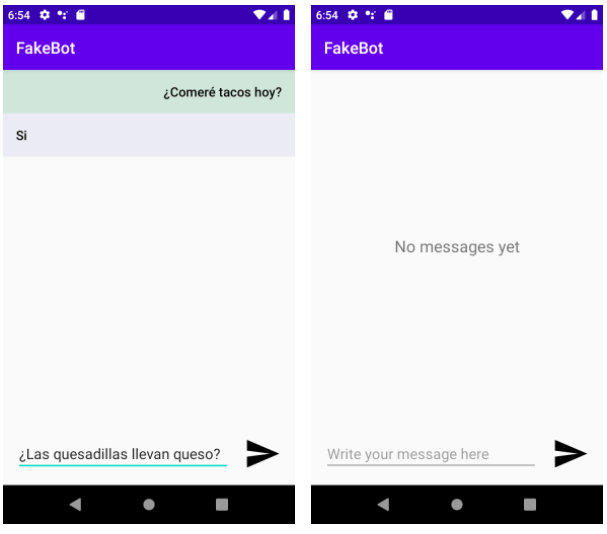

# Fake Bot

Al desarrollar esta aplicación practicarás los siguientes temas de Android:

- RecyclerViews.
- Adapters.
- Empty views.
- Runnable

Fake Bot es una app que simula ser un Bot que responde a tus preguntas automáticamente, te puede responder con las siguientes respuestas:

- Si
- No
- Pregunta de nuevo
- Es muy probable
- No lo creo
- No sé 🙁
- Tal vez

La app luce como una app de chat:

#### Tu misión es cumplir con los siguientes objetivos:

- Desarrollar la app para que, cuando des clic en el botón de enviar, agregue tu mensaje a un RecyclerView y lo muestre.
- Una vez que se agregue tu mensaje, la app deberá elegir una respuesta de las que insertaste de manera aleatoria y también agregarla al RecyclerView para simular que el Bot te respondió. 
- Si no hay elementos en la lista, mostrar un texto que diga que no hay mensajes todavía.
- Cuando se envía un mensaje, borrar el texto del campo de mensaje para poder volver a escribir sin tener que borrarlo a mano.
- Cuando se agrega un nuevo mensaje, el recyclerView se debe “scrollear” hasta la parte de abajo para poder ver el último mensaje agregado. Observa cómo funciona Whatsapp u otra app de chat para que veas a lo que me refiero.

#### Restricciones y corner cases:

Estas son algunas restricciones y casos especiales que hay que tomar en cuenta.

- Puedes usar cualquier tipo de Layout para realizar los diseños.
- Puedes hacerlo con o sin data binding, no importa.
- Si das clic en enviar pero el campo de mensaje está vacío debe aparecer un toast que diga “Debes insertar un mensaje para enviarlo”.
- Que las preguntas aparezcan del lado derecho con fondo verde y las respuestas del lado izquierdo con fondo azul (Mira la imagen de la app más arriba)
- Simula un retraso de 1 o 2 segundos entre cuando haces la pregunta y cuando el bot te responde.
- Implementa un ViewModel para manejar la lógica, la lista de mensajes estaría en un LiveData para que cuando agregues nuevos mensajes se actualice el adapter.